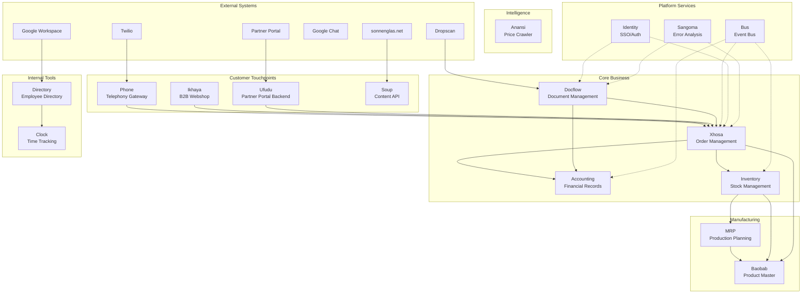
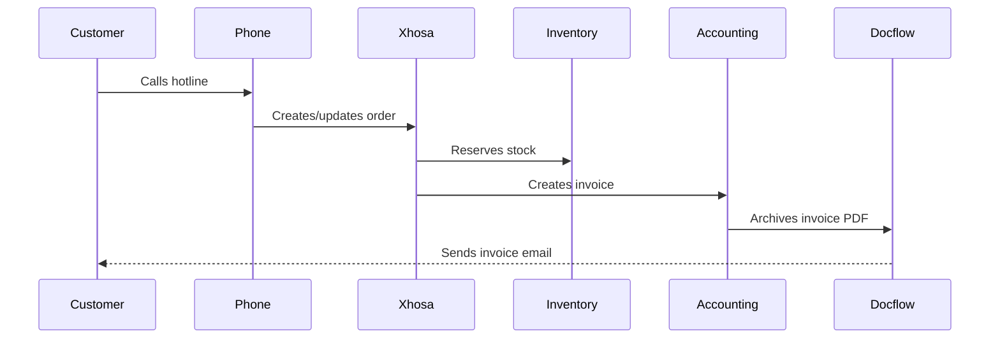
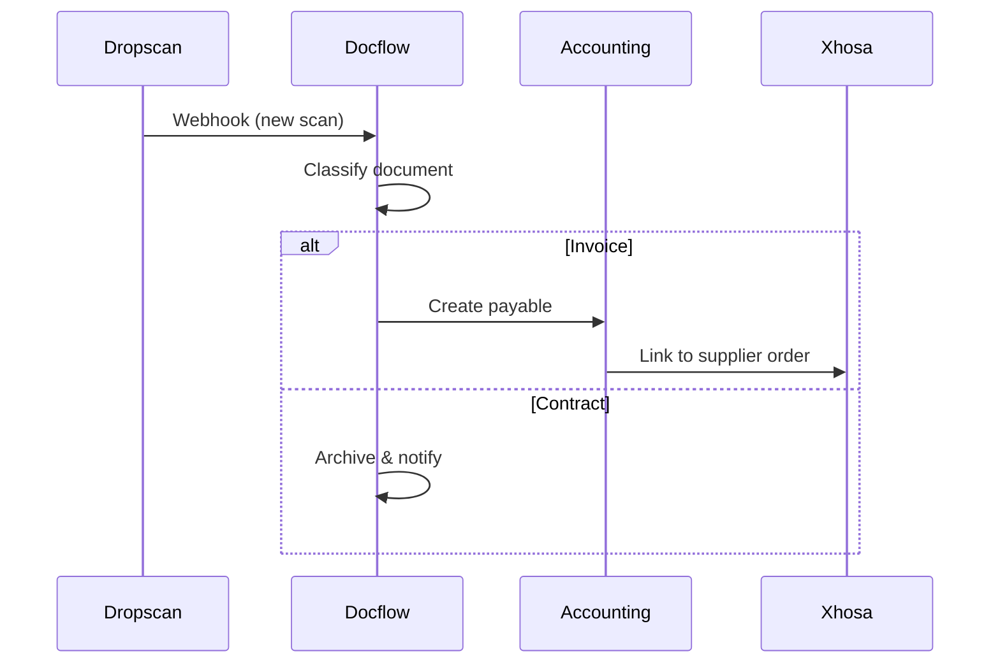
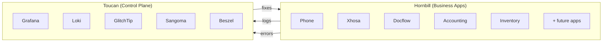

# Architecture Overview

## System Landscape

## Application Status

| App | Purpose | Server | Status |
|-----|---------|--------|--------|
| **Phone** | Twilio telephony gateway | Hornbill | Live |
| **Xhosa** | Order management (ERP core) | Hornbill | Live |
| **Docflow** | Document processing & archive | Hornbill | Live |
| **Accounting** | Financial records & reporting | Hornbill | Planned |
| **Inventory** | Stock levels & movements | Hornbill | Planned |
| **Baobab** | Product & brand master data | Hornbill | Concept |
| **MRP** | Manufacturing planning | Hornbill | Concept |
| **Ufudu** | Partner portal backend | Hornbill | Planned |
| **Soup** | Content API for website | Hornbill | Planned |
| **Anansi** | Competitor price crawling | Hornbill | Concept |
| **Ikhaya** | B2B webshop | Hornbill | Concept |
| **Directory** | Employee directory | Hornbill | Planned |
| **Clock** | Time tracking | Hornbill | Concept |
| **Bus** | Event message broker | Hornbill | Concept |
| **Identity** | SSO/authentication | Hornbill | Concept |
| **Sangoma** | Automated error analysis | Toucan | Concept |

## Data Flow: Order Lifecycle

## Data Flow: Document Processing

## Server Distribution

## Integration Points

| From | To | Method | Purpose |
|------|-----|--------|---------|
| Twilio | Phone | Webhook | Incoming calls |
| Dropscan | Docflow | Webhook | Scanned documents |
| Phone | Xhosa | Internal API | Order creation |
| Xhosa | Accounting | Internal API | Invoice generation |
| Xhosa | Inventory | Internal API | Stock reservation |
| Docflow | Accounting | Internal API | Payables from invoices |
| Bus | All apps | Redis pub/sub | Event distribution |
| Identity | All apps | OAuth/OIDC | Authentication |
| GlitchTip | Sangoma | API polling | Error collection |
| Sangoma | GitHub | API | PR/issue creation |
